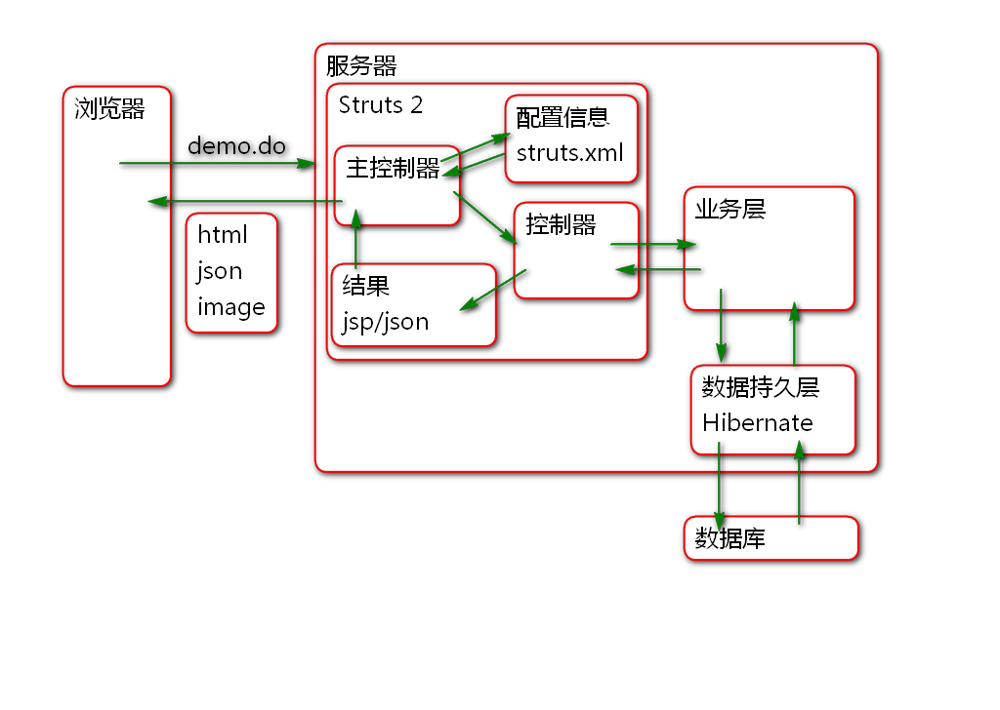
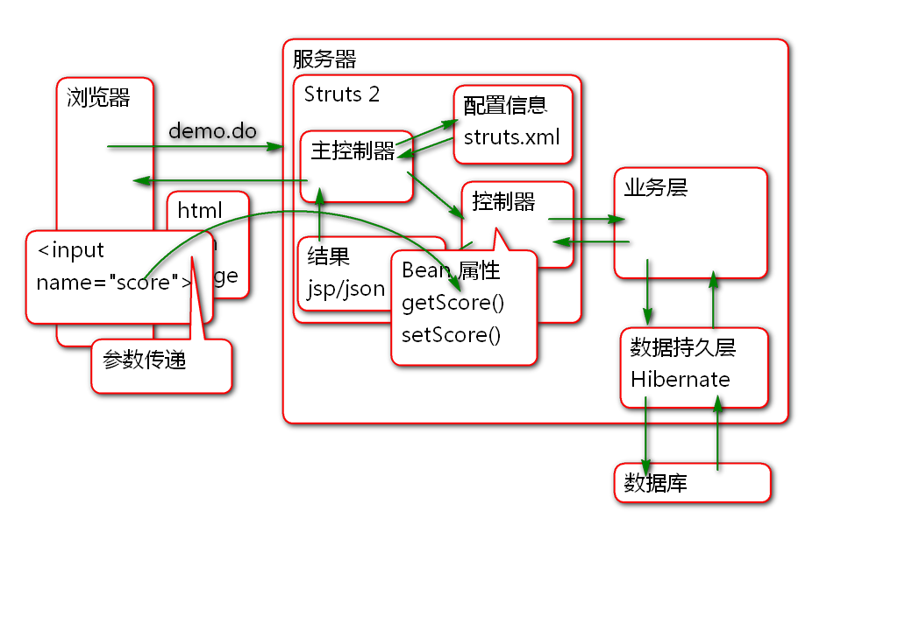
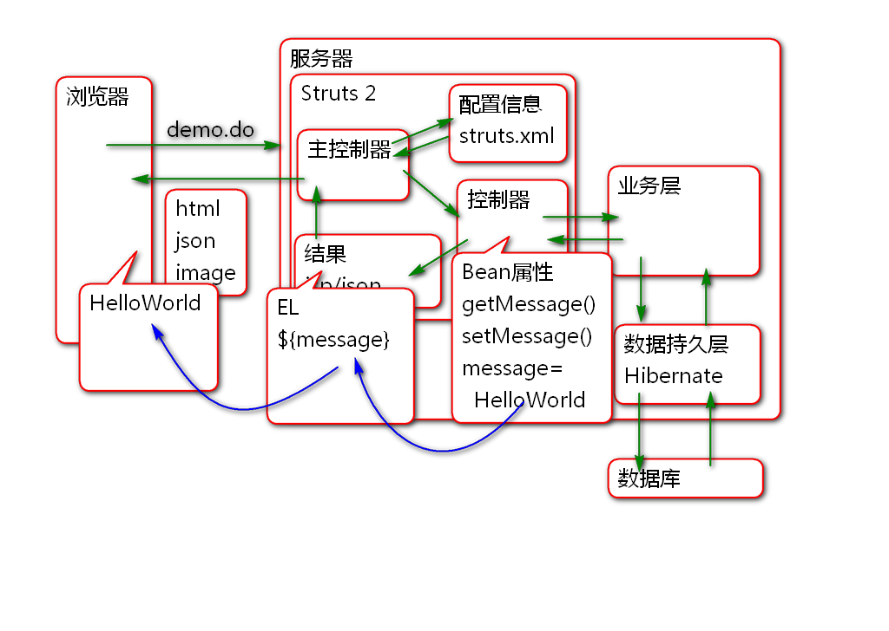
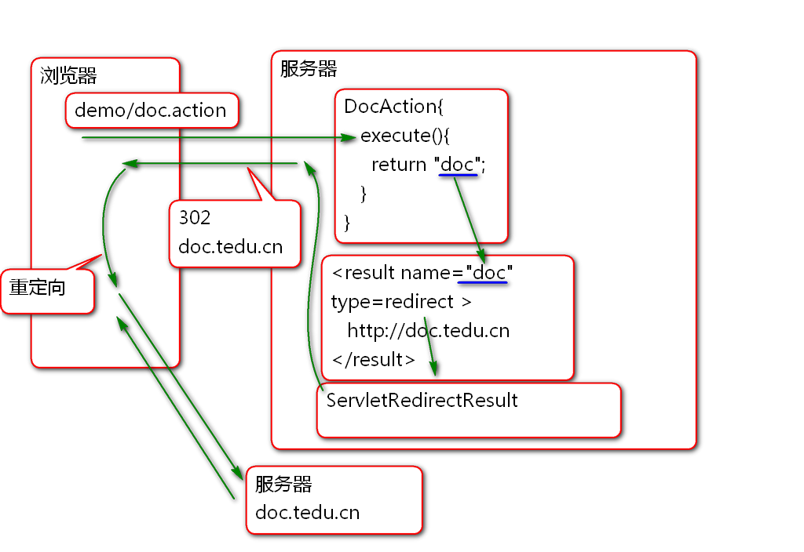
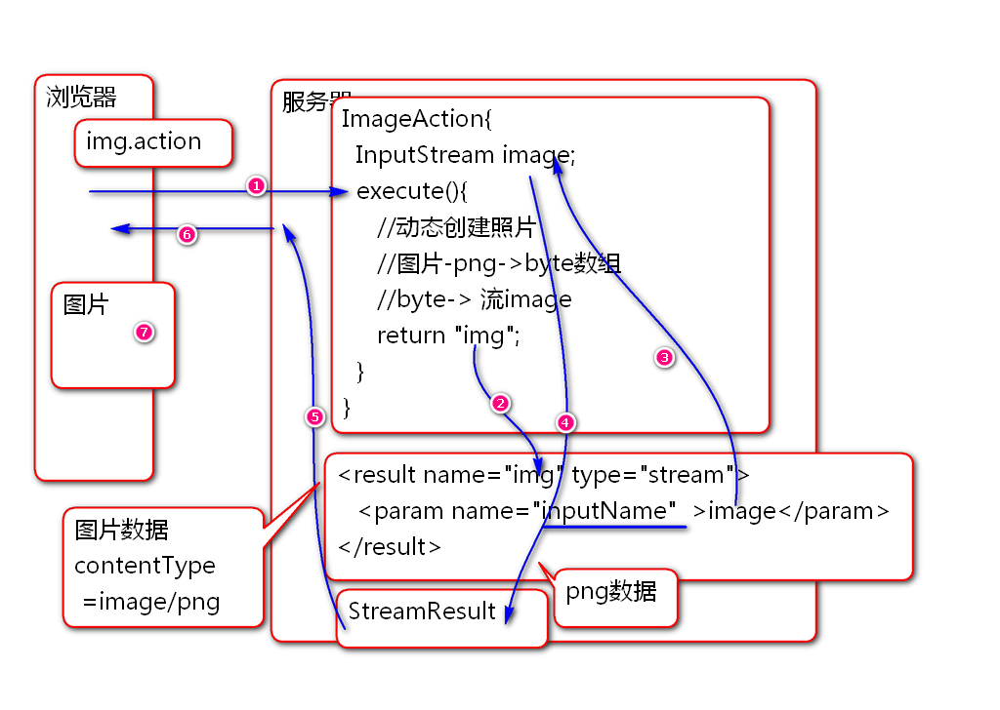

# SSH

Spring + Struts 2 + Hibernate = SSH

Spring + Spring MVC + MyBatis = SSM 

## Struts 2

Struts1 和 Struts2 没有任何关系.

Struts2 前身是 WebWorks 采用MVC设计模式的WEB应用框架.

## 使用Struts2  

步骤:

1. 导包
2. 配置
	1. 主控制器的配置 web.xml 
	2. 配置子控制器 struts.xml
	3. 测试
3. Hello World
	1. 编写子控制器
	2. JSP
	3. 配置 控制器和JSP的转发关系
4. 部署测试.

### Hello World

1. 导包 pom.xml

		<!-- Struts 2 核心包 -->
		<dependency>
		  <groupId>org.apache.struts</groupId>
		  <artifactId>struts2-core</artifactId>
		  <version>2.5.12</version>
		</dependency>  
	  
2. 配置
	1. 配置主控制器 web.xml
			
			  <filter>
			    <display-name>StrutsPrepareAndExecuteFilter</display-name>
			    <filter-name>StrutsPrepareAndExecuteFilter</filter-name>
			    <filter-class>org.apache.struts2.dispatcher.filter.StrutsPrepareAndExecuteFilter</filter-class>
			  </filter>
			  <filter-mapping>
			    <filter-name>StrutsPrepareAndExecuteFilter</filter-name>
			    <url-pattern>/*</url-pattern>
			  </filter-mapping>
	
	2. 添加配置文件struts.xml 

			<?xml version="1.0" encoding="UTF-8"?>
			<!DOCTYPE struts PUBLIC
				"-//Apache Software Foundation//DTD Struts Configuration 2.5//EN"
				"http://struts.apache.org/dtds/struts-2.5.dtd">
			<struts>
			</struts>
			
	3. 测试

3. Hello World
	1. 控制器类:

			/**
			 * Struts2 的控制器类
			 * 就是普通Java类
			 */
			public class DemoAction {
				
				/**
				 * 控制器中的 流程控制方法 一般是execute方法
				 * 返回值 success 代表JSP页面的名称 
				 */
				public String execute(){
					System.out.println("Hello World!");
					return "success";
				}
			}

	2. 编写JSP文件: demo.jsp

			<%@ page contentType="text/html; charset=utf-8"
			    pageEncoding="UTF-8"%>
			<!DOCTYPE html>
			<html>
			<head>
			<meta charset="UTF-8">
			<title>DEMO</title>
			</head>
			<body>
				<!-- /WEB-INF/jsp/demo.jsp -->
				<h1>Hello World!</h1>
			</body>
			</html>

	3. 配置struts.xml

			<!-- name 属性就是一个标识,写啥都行,不能重复 -->
			<!-- namespace 用于声明第一层请求web路径
			 http://localhost:8080/ssh1/demo -->
			<!-- extends 用于继承Struts2的默认配置 -->
			<package name="demo" 
				namespace="/demo"
				extends="struts-default"> 
				<!-- action 中的name是第二层 
				 http://localhost:8080/ssh1/demo/hello.action -->
				<!-- 请求 /demo/hello.action时候执行
				DemoAction类中的控制方法 execute -->
				<action name="hello" 
					class="cn.tedu.action.DemoAction">
					<!-- 当控制方法返回success时候
					转发到 demo.jsp -->
					<result name="success">
						/WEB-INF/jsp/demo.jsp
					</result>
				</action>
				
			</package>
			
4. 部署测试.

		http://localhost:8080/ssh1/demo/user.action	

## 浏览器向控制器发送参数

### 使用控制器Bean属性接收参数

原理:

步骤:

1. 编写demo.html

		<!DOCTYPE html>
		<html>
		<head>
		<meta charset="UTF-8">
		<title>从浏览器到控制器传输参数</title>
		</head>
		<body>
			<h1>从浏览器到控制器传输参数</h1>
			<form action="demo/param.action" 
				method="post"> 
				<input type="text" name="score"> 
				<input type="text" name="user"> 
				<input type="submit" value="保存"> 
			</form>
		</body>
		</html>
		 
2. 编写控制器
		
		public class ParamAction {
			private Integer score;
			private String user;
			public Integer getScore() {
				return score;
			}
			public void setScore(Integer score) {
				this.score = score;
			}
			public String getUser() {
				return user;
			}
			public void setUser(String user) {
				this.user = user;
			}
			
			/**
			 * 流程控制器方法 
			 * Struts2 会在执行控制器方法之前调用
			 * getXXX, setXXX 注入用户提交的参数!
			 */
			public String execute(){
				//展示从浏览器接收到参数
				System.out.println("score:"+score);
				System.out.println("user:"+user);
				return "success";
			}
		}

3. 配置 struts.xml

		<!-- 浏览器到控制器传递参数 -->
		<action name="param"
			class="cn.tedu.action.ParamAction">
			<result name="success">
				/WEB-INF/jsp/demo.jsp
			</result>
		</action>

4. 测试

###  使用域模型(值对象)打包传递参数

原理:

案例:

1. 编写user-demo.html
		
		<!DOCTYPE html>
		<html>
		<head>
		<meta charset="UTF-8">
		<title>域模型封装参数</title>
		</head>
		<body>
			<h1>域模型封装参数</h1>
			<form action="demo/user.action" method="post">
				姓名:<input type="text" name="user.name"> 
				年龄:<input type="text" name="user.age"> 
				分数:<input type="text" name="user.score"> 
				<input type="submit" value="提交">
			</form>
		</body>
		</html>

2. 编写值对象

		public class UserVo {
			private String name;
			private Integer age;
			private Integer score;
			public String getName() {
				return name;
			}
			public void setName(String name) {
				this.name = name;
			}
			public Integer getAge() {
				return age;
			}
			public void setAge(Integer age) {
				this.age = age;
			}
			public Integer getScore() {
				return score;
			}
			public void setScore(Integer score) {
				this.score = score;
			}
			@Override
			public String toString() {
				return "UserVo [name=" + name + ", age=" + age + ", score=" + score + "]";
			}
		}	

3. 编写控制器
		
		public class UserAction {
		
			private UserVo user;
			
			public void setUser(UserVo user) {
				this.user = user;
			}
			
			public UserVo getUser() {
				return user;
			}
			
			public String save(){
				//展示接收到的数据
				System.out.println(user);
				return "success";
			}
		}

4. 配置 struts.xml

		<!-- 将表单数据打包为域模型对象传递到控制器 -->
		<action name="user"
			class="cn.tedu.action.UserAction"
			method="save"> 
			<result name="success">
				/WEB-INF/jsp/demo.jsp
			</result>
		</action>

5. 测试

### 将数据从控制器显示到JSP中

Struts2 控制器的Bean属性可以在JSP中使用EL表达式访问.

原理:

案例:

1. 编写控制器

		public class MessageAction {
			private String message;
			public void setMessage(String message) {
				this.message = message;
			}
			public String getMessage() {
				return message;
			}
			public String execute(){
				message = "Hello World!";
				return "success";
			}
		}

2. 编写JSP: message.jsp
		
		<%@ page contentType="text/html; charset=utf-8"
		    pageEncoding="UTF-8"%>
		<!DOCTYPE html>
		<html>
		<head>
		<meta charset="UTF-8">
		<title>DEMO</title>
		</head>
		<body>
			<h1>展示控制器的值</h1>
			
${ message }
 
		</body>
		</html>

3. 配置 struts.xml

		<!-- 将控制器中的值展示到JSP上 -->
		<action name="msg" 
			class="cn.tedu.action.MessageAction">
			<result name="success">
				/WEB-INF/jsp/message.jsp
			</result>	
		</action>
4. 测试

## Result 结果

用于处理控制器的返回结果

默认情况下, 使用 extends="struts-default" 继承了, struts-default.xml 文件中声明的 result 类型.

Struts 的默认结果类型是 dispatcher, 最终利用 ServletDispatcherResult 类进行结果的处理.

### redirect 重定向

原理:

案例:

1. 控制器

		public class DocAction {
			
			public String execute(){
				System.out.println("DocAction"); 
				return "doc";
			}
		}

2. 配置: struts.xml

		<!-- 重定向结果类型 -->
		<action name="doc"
			class="cn.tedu.action.DocAction">
			<result name="doc" type="redirect"> 				
				http://doc.tedu.cn
			</result>	
		</action>

3. 测试

### 重定向到其他控制器 redirectAction

原理:

案例:

1. 控制器

		public class TestAction {
			
			public String execute(){
				System.out.println("TestAction");
				return "test";
			}
			
		}

2. 配置文件 struts.xml

		<!-- 重定向到其他控制器 -->
		<action name="test"
			class="cn.tedu.action.TestAction">
			<result name="test"
				type="redirectAction">
				hello
			</result>	
		</action>

3. 测试

### Stream Result 

原理:

步骤:

1. 控制器
		
		public class ImageAction {
			private InputStream image;
			public InputStream getImage() {
				return image;
			}
			public void setImage(InputStream image) {
				this.image = image;
			}
				
			public String execute(){
				//生成图片...
				try {
					byte[] data = createPngImage();
					image = new ByteArrayInputStream(data);
					return "img";
				} catch (IOException e) {
					e.printStackTrace();
					return "error";
				}
			}
			
			public byte[] createPngImage() throws IOException{
				//创建 BufferedImage对象
				BufferedImage img = new BufferedImage(
					200, 100, BufferedImage.TYPE_3BYTE_BGR);
				img.setRGB(0, 0, 0xff0000); 
				img.setRGB(100, 50, 0xffff00); 
				//利用API将图片对象编码为 png
				//酱油瓶子out(变长byte数组)
				ByteArrayOutputStream out=
						new ByteArrayOutputStream();
				ImageIO.write(img, "png", out);
				//再获取PNG数据数组
				out.close();
				//从酱油瓶子中倒出数据(byte[])
				byte[] data = out.toByteArray();
				return data;
			}
		}

2. 错误页面: /WEB-INF/jsp/error.jsp

		<%@ page contentType="text/html; charset=utf-8"
		    pageEncoding="UTF-8"%>
		<!DOCTYPE html>
		<html>
		<head>
		<meta charset="UTF-8">
		<title>DEMO</title>
		</head>
		<body>
			<!-- /WEB-INF/jsp/demo.jsp -->
			<h1>错误了!</h1>
		</body>
		</html>

3. 配置:

		<!-- 利用Stream Result 动态下载图片 -->
		<action name="img"
			class="cn.tedu.action.ImageAction">
			<result name="img" type="stream">
				<param name="inputName">
					image
				</param>
				<param name="contentType">
					image/png
				</param>
			</result>
			<result name="error">
				/WEB-INF/jsp/error.jsp
			</result>
		</action>

4. 测试

--------------------------------

作业

1. 熟练创建项目配置Struts2环境

2. 开发课堂全部案例

 

