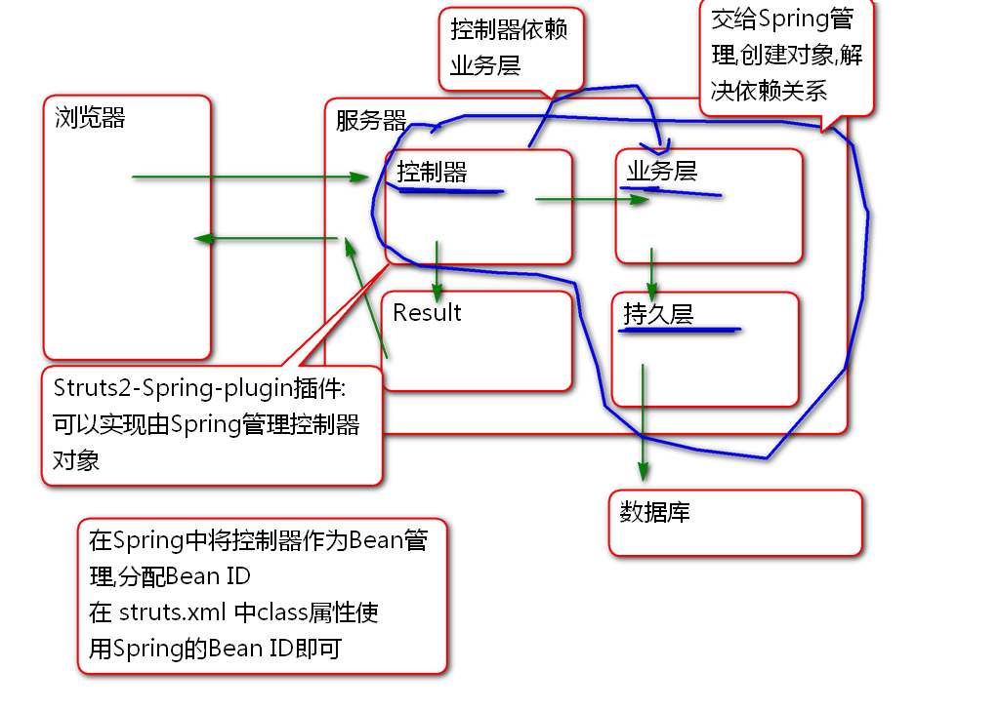
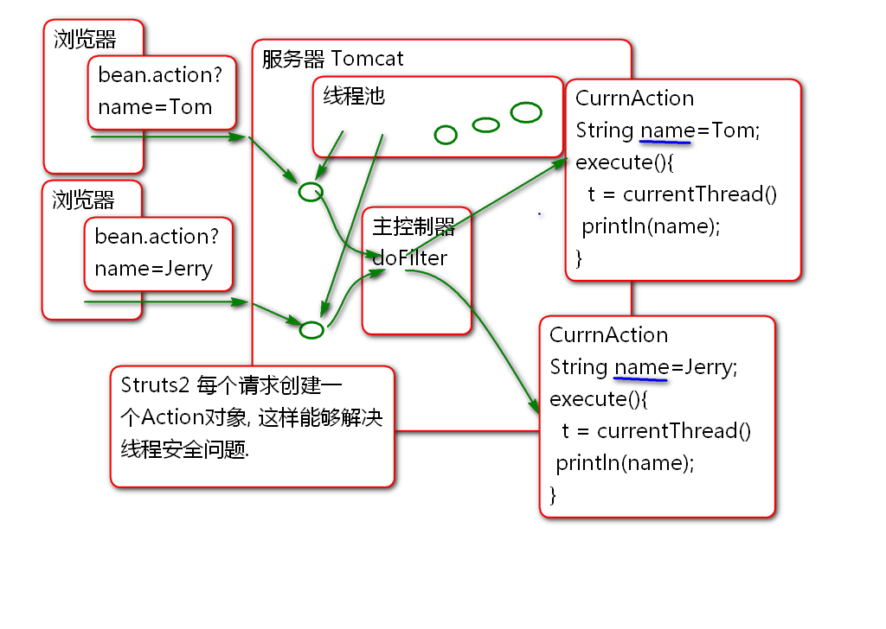
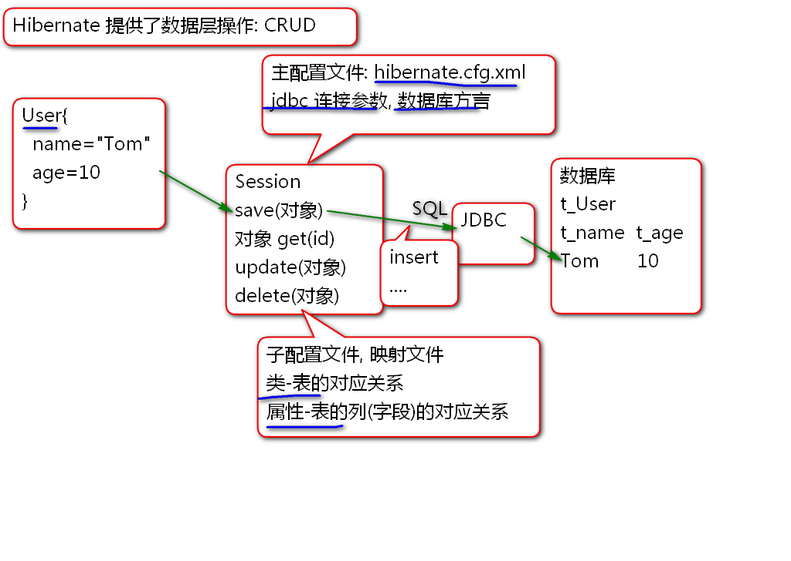

# SSH

## Struts 2

### Stream Result

Stream Result 不仅可以处理 图片, 它还可以处理任何类型的文件, 比如处理Excel文件. 

案例:

1. 导入Excel API: Apache POI

		<dependency>
		  <groupId>org.apache.poi</groupId>
		  <artifactId>poi</artifactId>
		  <version>3.9</version>
		</dependency>

2.  编写控制器

		public class ExcelAction {
			private InputStream excel;
			
			public InputStream getExcel() {
				return excel;
			}
			public void setExcel(InputStream excel) {
				this.excel = excel;
			}
			
			public String execute(){
				try {
					byte[] data = createExcel();
					excel=new ByteArrayInputStream(data);
					return "exl";
				} catch (IOException e) {
					e.printStackTrace();
					return "error";
				}
			}
			
			public byte[] createExcel() throws IOException{
				// Apache poi
				// 工作簿   >工作表>行>格子
				//workbook> sheet>row>cell
				
				//创建工作簿
				HSSFWorkbook workbook=
						new HSSFWorkbook();
				//在工作簿中创建工作表
				HSSFSheet sheet = 
						workbook.createSheet("演示");
				//工作表里创建数据行
				HSSFRow row = sheet.createRow(0);
				//在行中创建格子
				HSSFCell c1 = row.createCell(0);
				//在格子中添加内容
				c1.setCellValue("编号");
				row.createCell(1).setCellValue("内容");
				//再添加一行
				row = sheet.createRow(1);
				row.createCell(0).setCellValue("1");
				row.createCell(1)
					.setCellValue("Hello World!");
				//将excel对象转换为数据
				ByteArrayOutputStream out=
					new ByteArrayOutputStream();
				workbook.write(out);
				out.close();
				byte[] data = out.toByteArray();
				return data;
			}
		}

3. 配置: struts.xml

		<action name="excel" 
			 class="cn.tedu.action.ExcelAction">
			 <result  name="exl" type="stream">
			 	<param name="inputName">excel</param>
			 	<param name="contentType">
			 		application/vnd.ms-excel
			 	</param>
			 	<param name="contentDisposition">
			 		attachment;filename="hello.xls"
			 	</param>
			 </result>
			 <result name="error">
			 	/WEB-INF/jsp/error.jsp
			 </result>
		</action>

	> 其中 contentDisposition 属性用于指定下载文件名

4. 测试...

### Json Result

Struts2 利用插件支持了 Json Result

	<dependency>
	  <groupId>org.apache.struts</groupId>
	  <artifactId>struts2-json-plugin</artifactId>
	  <version>2.5.12</version>
	</dependency>

在插件中包含文件 struts-plugin.xml 

    <package name="json-default" extends="struts-default">

        <result-types>
            <result-type name="json" class="org.apache.struts2.json.JSONResult"/>
            <result-type name="jsonActionRedirect" class="org.apache.struts2.json.JSONActionRedirectResult"/>
        </result-types>
		...

> 在这个文件可以看出: json-default 命名空间扩展了 struts-default 命名空间, 扩展出新的结果类型 json. 只需要继承 json-default  就可以同时使用 json-default  和 struts-default中全部的结果类型了.

默认情况下json类型结果: 将控制器的全部属性序列化为JSON字符串发送到客户端.

原理

案例:

1. 编写控制器

		public class JsonAction {
			private String name;
			private int age;
			public String getName() {
				return name;
			}
			public void setName(String name) {
				this.name = name;
			}
			public int getAge() {
				return age;
			}
			public void setAge(int age) {
				this.age = age;
			}
			
			public String execute(){
				name = "Tom";
				age = 5;
				return "json";
			}
		}
		
2. 配置:

		<!-- 继承json-default才能使用json类型的
		Result -->	
		<package name="test" namespace="/test" extends="json-default">
			<!-- 默认情况下json Result将控制器
			的全部Bean属性序列化为JSON字符串发送
			到客户端 -->
			<action name="json" class="cn.tedu.action.JsonAction">
				<result name="json" type="json"/>
			</action>
		</package>

3. 测试

## Spring 与 Struts2 整合

利用Spring作为工厂管理 Struts2 的控制器, 可以利用Spring为控制器注入业务层组件, 解决控制器依赖业务层组件问题:

步骤:

1. 添加 Spring插件:
	
		<!-- 引入Spring, 将控制器对象的控制权
		交给Spring(IOC), 由Spring负责创建控制器
		对象,为控制器对象注入属性(业务层对象) -->
		<dependency>
		  <groupId>org.apache.struts</groupId>
		  <artifactId>struts2-spring-plugin</artifactId>
		  <version>2.5.12</version>
		</dependency>

2. 添加Spring配置文件: spring-struts.xml
		
		<?xml version="1.0" encoding="UTF-8"?>
		<beans default-lazy-init="true"
		    xmlns="http://www.springframework.org/schema/beans" 
		    xmlns:p="http://www.springframework.org/schema/p"
		    xmlns:xsi="http://www.w3.org/2001/XMLSchema-instance" 
		    xmlns:context="http://www.springframework.org/schema/context"
		    xmlns:tx="http://www.springframework.org/schema/tx"
		    xmlns:mvc="http://www.springframework.org/schema/mvc"
		    xsi:schemaLocation="  
		       http://www.springframework.org/schema/beans   
		       http://www.springframework.org/schema/beans/spring-beans-4.1.xsd  
		       http://www.springframework.org/schema/mvc   
		       http://www.springframework.org/schema/mvc/spring-mvc-4.1.xsd   
		       http://www.springframework.org/schema/tx   
		       http://www.springframework.org/schema/tx/spring-tx-4.1.xsd   
		       http://www.springframework.org/schema/context  
		       http://www.springframework.org/schema/context/spring-context-4.1.xsd" >  
			
			<context:component-scan 
				base-package="cn.tedu.action"/>
		     
		</beans>
		
	> 注意: 配置文件的版本要与插件Spring的版本一致.

3. 编写控制器, 由Spring管理:

		@Controller// Bean ID: beanAction
		@Scope("prototype")
		public class BeanAction {	
			public String execute(){
				Thread t=Thread.currentThread();
				System.out.println(t); 
				System.out.println("Hello World!");
				return "success";
			}
		}

	> 为了解决线程安全问题使用@Scope("prototype")

4. 配置struts.xml

		<!-- 使用Spring管理控制器Bean -->
		<action name="bean" class="beanAction">
			<result name="success">
				/WEB-INF/jsp/demo.jsp
			</result>
		</action>
	
	> 注意: 当class="beanAction"时候使用Spring Bean ID 时候, 就表示利用SPring管理控制器对象.

5. 测试...

## Struts2 控制器线程安全

1. Struts2 默认情况下, 为每个用户线程创建独立的Action对象, 所以Struts2 控制器是线程安全的.

2. 当使用Spring管理Struts2 控制器时候需要使用 @Scope("prototype") 为每个请求单独创建Action对象, 这样才能解决线程安全问题.

原理:

案例:

1. 编写控制器类:

		@Controller
		@Scope("prototype")
		public class CurrnAction {
			String name;
			public String getName() {
				return name;
			}
			public void setName(String name) {
				this.name = name;
			}
			
			public String execute() throws Exception{
				Thread t = Thread.currentThread();
				Thread.sleep(10000);
				System.out.println(t); 
				System.out.println(name);
				return "success";
			}
		}

2. 配置: struts.xml

		<action name="currn"
			class="currnAction">
			<result name="success">
				/WEB-INF/jsp/demo.jsp
			</result>
		</action>

3. 测试

	> 当去掉 @Scope("prototype") 时候会出现线程并发安全问题.

# Hibernate

Struts 架子
Hibernate 冬眠
Spring 春天

Hibernate

1. 不用写get set 方法绑定参数
2. 按照对象的方式操作数据库, 可以忘记SQL
3. 自动生成SQL, 无需书写SQL
4. 自动为不同数据库生成SQL, 解决数据库差异问题.

Hibernate的理想是一切面向对象但是:

1. 生成的SQL不够干练, 不够简洁, 性能有瑕疵.
2. 虽然无需写SQL,但是需要学习 HQL
3. 实际开发中, 数据库是重来不更换的!

## 使用Hibernate

1. 导入 Hibernate 和 数据库驱动:

		<dependency>
		  <groupId>org.hibernate</groupId>
		  <artifactId>hibernate-core</artifactId>
		  <version>4.3.9.Final</version>
		</dependency>
			<!-- 添加mysql驱动 (不要选5.1.6) -->
	
		<dependency>
			<groupId>mysql</groupId>
			<artifactId>mysql-connector-java</artifactId>
			<version>5.1.40</version>
		</dependency>
	
2. 配置Hibernate主配置文件: hibernate.cfg.xml

		<?xml version="1.0" encoding="UTF-8"?>
		<!DOCTYPE hibernate-configuration PUBLIC
			"-//Hibernate/Hibernate Configuration DTD 3.0//EN"
			"http://www.hibernate.org/dtd/hibernate-configuration-3.0.dtd">
		<hibernate-configuration>
			<session-factory>
				<property name="connection.driver_class">
					com.mysql.jdbc.Driver
				</property>
				<property name="connection.url">
					jdbc:mysql://localhost:3306/ssh
				</property>
				<property name="connection.username">
					root
				</property>
				<property name="connection.password">
					root
				</property>
				<!-- 方言: Hibernate利用方言生成不同数据
				的SQL语句. -->
				<property name="dialect">
					org.hibernate.dialect.MySQL5Dialect
				</property>
				<!-- 在控制台输出生成的SQL语句 -->
				<property name="show_sql">true</property>
				<property name="format_sql">true</property>
				<!-- 指定子配置文件的位置 -->
				<mapping resource="mapping/User.hbm.xml"/>
			</session-factory>
		</hibernate-configuration>

3. 编写 SQL脚本, 创建表 

		create table t_user(
			t_id int,
			t_name varchar(100),
			t_age int,
			t_address varchar(200),
			primary key(t_id)
		)

4. 创建实体类:

		public class User implements Serializable {
			private static final long serialVersionUID = -1655083559936102631L;
		
			private Integer id;
			private String name;
			private Integer age;
			private String address;
			
			public User() {
			}
		
			public User(Integer id, String name, Integer age, String address) {
				super();
				this.id = id;
				this.name = name;
				this.age = age;
				this.address = address;
			}
		
			public Integer getId() {
				return id;
			}
		
			public void setId(Integer id) {
				this.id = id;
			}
		
			public String getName() {
				return name;
			}
		
			public void setName(String name) {
				this.name = name;
			}
		
			public Integer getAge() {
				return age;
			}
		
			public void setAge(Integer age) {
				this.age = age;
			}
		
			public String getAddress() {
				return address;
			}
		
			public void setAddress(String address) {
				this.address = address;
			}
		
			@Override
			public int hashCode() {
				final int prime = 31;
				int result = 1;
				result = prime * result + ((id == null) ? 0 : id.hashCode());
				return result;
			}
		
			@Override
			public boolean equals(Object obj) {
				if (this == obj)
					return true;
				if (obj == null)
					return false;
				if (getClass() != obj.getClass())
					return false;
				User other = (User) obj;
				if (id == null) {
					if (other.id != null)
						return false;
				} else if (!id.equals(other.id))
					return false;
				return true;
			}
		
			@Override
			public String toString() {
				return "User [id=" + id + ", name=" + name + ", age=" + age + ", address=" + address + "]";
			}
			
		}

5. 创建子配置文件 User.hbm.xml

		<?xml version="1.0" encoding="UTF-8"?>
		<!DOCTYPE hibernate-mapping PUBLIC 
		    "-//Hibernate/Hibernate Mapping DTD 3.0//EN"
		    "http://www.hibernate.org/dtd/hibernate-mapping-3.0.dtd">
		<hibernate-mapping>
			<!-- User 类与 t_user 对应 -->
			<class name="cn.tedu.entity.User"
				table="t_user">
				<!-- User的ID属性对应表的t_id列 -->
				<id type="int" name="id" column="t_id"></id>
				<!-- 映射普通属性 -->
				<property name="name" column="t_name"/>
				<property name="age" column="t_age"/>
				<property name="address" 
					column="t_address"/>
			</class>
		</hibernate-mapping>

6. 测试
		
		public class HbmTestCase {
			SessionFactory factory;
			Session session;
		
			@Before
			public void init(){
				Configuration cfg=new Configuration();
				//加载主配置文件
				cfg.configure("hibernate.cfg.xml");
				//创建工厂对象
				factory = cfg.buildSessionFactory();
				//创建Session对象
				session = factory.openSession();
			}
			
			@After
			public void destory(){
				//Session 使用以后务必关闭
				session.close();
				factory.close();
			}
			
			@Test
			public void testSave(){
				Transaction tx = 
						session.beginTransaction();
				User user = new User(
						1, "Tom", 5, "北京");
				session.save(user);
				tx.commit();
			}
			
		}

-------------------------

## 作业

1. 搭建Struts Spring整合环境,并且测试
2. 搭建Hibernate环境并且测试

