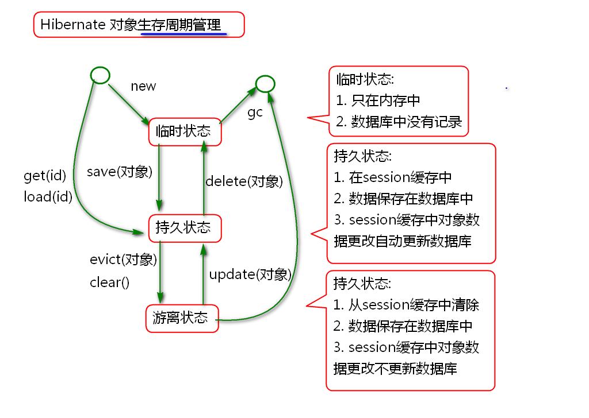
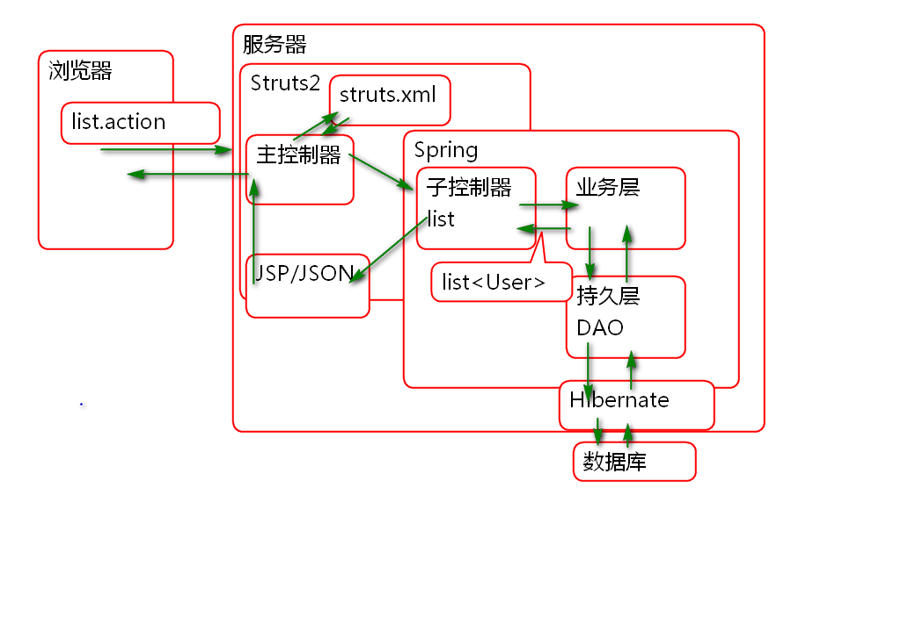

# SSH 

## Hibernate

### Hibernate提供的CRUD方法

Hibernate 的核心接口 Session 提供了对象的CRUD方法, 可以实现对象的增删改查操作.

案例:

	@Test
	public void testSave(){
		Transaction tx = 
				session.beginTransaction();
		User user = new User(
			1, "Tom", 5, "北京");
		session.save(user);
		//user = new User(
		//	2, "Jerry", 5, "上海");
		//session.save(user);
		//user = new User(
		//	3, "李洪鹤", 6, "北京");
		//session.save(user);
		tx.commit();
	}
	
	@Test
	public void testGet(){
		User user = (User)session.get(
			User.class, 1);
		System.out.println(user); 
	}
	
	@Test
	public void testUpdate(){
		Transaction tx=session.beginTransaction();
		User user = (User)session.get(User.class, 1);
		user.setName("范萌萌"); 
		session.update(user);
		tx.commit();
	}
	
	@Test
	public void testDelete(){
		Transaction tx = session.beginTransaction();
		User user = (User) session.get(User.class, 1);
		session.delete(user);
		tx.commit();
	}

### HQL

Hibernate 提供了与数据库无关的HQL. HQL语法接近于SQL:

1. 查询全部的属性时候需要省略 select *, 查询部分属性时候不能省略
2. 将sql查询中的表名替换为对应的类名
3. 将SQL查询中的列名替换为对应的属性
4. HQL支持参数查询
	1. 可以按照序号绑定参数
	2. 可以按照参数名称绑定参数

案例:

	@Test
	public void testFindAll(){
		//sql: select * from t_user
		//hql:          from User
		String hql="from User";
		Query query=session.createQuery(hql);
		List<User> list=query.list();
		for (User user : list) {
			System.out.println(user);
		}
	}
	
	
	@Test
	public void testFindByAddress(){
		String addr = "北京";
		//sql:select * from t_user 
		//    where t_address=?
		//hql:         from User
		//    where address=?
		String hql = "from User "
				+ "where address=?"; 
		Query query=session.createQuery(hql);
		//参数绑定
		query.setString(0, addr);
		List<User> list = query.list();
		for (User user : list) {
			System.out.println(user); 
		}
	}
	
	@Test
	public void testFindByAge(){
		int age=5;
		String hql="from User "
				+ "where age=:age";
		Query query=session.createQuery(hql);
		//按照名称替换参数,替换 :age 为 5
		query.setInteger("age", age);
		List<User> list=query.list();
		for (User user : list) {
			System.out.println(user); 
		}
	}
	
	
	@Test
	public void testFind(){
		//sql: select t_id, t_name 
		//     from t_user
		//     where t_address=?
		//HQL: select new map(
		//     id as id, name as name) 
		//     from User
		//     where address=?
		String hql="select new map("
				+ "id as id, name as name) "
				+ "from User "
				+ "where address=?";
		Query query = session.createQuery(hql);
		query.setString(0, "北京");
		List<Map<String, Object>> list=
			query.list();
		for (Map<String, Object> map : list) {
			System.out.println(map); 
		}
	}

### Hibernate对象生存周期管理

Hibernate 管理实体对象的声明周期, 有3个状态:

案例:

	@Test
	public void testState1(){
		Transaction tx = session.beginTransaction();
		//临时状态
		User user = new User(5, "Andy", 7, "上海");
		//持久状态
		session.save(user);
		//持久状态下更新属性将自动更新数据库
		user.setName("Wang");
		tx.commit();
	}
	
	@Test
	public void testState2(){
		Transaction tx=session.beginTransaction();
		//临时状态
		User user = new User(8, "范传奇", 8, "北京");
		//持久状态
		session.save(user);
		user.setAge(20);
		//强制执行缓存在session中的SQL
		session.flush();
		//游离状态
		session.evict(user);
		user.setAge(30);
		session.flush();
		tx.commit();
	}
	
	@Test
	public void testState3(){
		Transaction tx = session.beginTransaction();
		//get返回的对象是持久状态的
		User user=
			(User)session.get(User.class, 8);
		//游离状态
		session.evict(user);
		user.setAddress("昆明");
		//返回持久状态
		session.update(user);
		tx.commit();
	}

## Spring 整合管理Hibernate

Spring 提供了专门管理Hibernate的ORM包.

利用Spring提供的API时候, 访问Hibernate更加方便简洁.

1. LocalSessionFactoryBean 用于管理 SessionFactory, 减少了创建SessionFactory的麻烦.
2. HibernateTemplate 封装了Session对象, 比Sesison更加简洁.
3. HibernateTransactionManager 提供了事务管理, 利用Spring声明式事务, 简化事务处理过程.

配置步骤:

1. 配置数据源
2. 配置 SessionFactory
3. 配置 HibernateTemplate
4. 配置 HibernateTransactionManager 和声明式事务

### 配置 SessionFactory

1. 导入包:

		<!-- 添加alibaba的druid连接池依赖 -->
		<dependency>
			<groupId>com.alibaba</groupId>
			<artifactId>druid</artifactId>
			<version>1.0.23</version>
		</dependency>
		
		<dependency>
		  <groupId>org.springframework</groupId>
		  <artifactId>spring-orm</artifactId>
		  <version>4.1.6.RELEASE</version>
		</dependency>

2. 连接配置信息文件 jdbc.properties
		
		jdbc.driver=com.mysql.jdbc.Driver
		jdbc.url=jdbc:mysql://localhost:3306/ssh
		jdbc.username=root
		jdbc.password=root
		jdbc.initialSize=5
		jdbc.maxActive=50
		jdbc.minIdle=0
		jdbc.maxWait=60000
		jdbc.druid.filters=
		jdbc.timeBetweenLogStatsMillis=60000

3. 配置数据源 spring-pool.xml:

		<!-- 加载jdbc.properties文件(一般加载多个文件时 可考虑使用此方式) -->
		<bean id="propertyConfigurer" class="org.springframework.beans.factory.config.PropertyPlaceholderConfigurer">
			<property name="locations">
				<list>
					<value>classpath:jdbc.properties</value>
	
				</list>
			</property>
		</bean>
	
	
		<!-- 配置DRUID连接池(这个连接池的说明: http://github.com 在搜索栏输入druid查找) -->
		<bean id="stat-filter" class="com.alibaba.druid.filter.stat.StatFilter"
			lazy-init="true">
			<description>状态过滤器</description>
			<!-- 通过slowSqlMillis用来配置SQL慢的标准 -->
			<property name="slowSqlMillis" value="3000" />
			<!-- 以日志形式输出执行效率慢的SQL -->
			<property name="logSlowSql" value="true" />
			<!-- 通过mergeSql属性，合并SQL -->
			<property name="mergeSql" value="true" />
		</bean>
	
		<!--配置DruidDataSource连接池 -->
		<bean id="dataSource" class="com.alibaba.druid.pool.DruidDataSource"
			destroy-method="close" init-method="init" lazy-init="true">
			<property name="driverClassName" value="${jdbc.driver}" />
			<property name="url" value="${jdbc.url}" />
			<property name="username" value="${jdbc.username}" />
			<property name="password" value="${jdbc.password}" />
			<!-- 初始化连接大小 -->
			<property name="initialSize" value="${jdbc.initialSize}" />
			<!-- 连接池最大数量 -->
			<property name="maxActive" value="${jdbc.maxActive}" />
			<!-- 连接池最小空闲 -->
			<property name="minIdle" value="${jdbc.minIdle}" />
			<!-- 获取连接最大等待时间 -->
			<property name="maxWait" value="${jdbc.maxWait}" />
			<!--配置了maxWait之后，缺省启用公平锁，并发效率会有所下降，如果需要可以通过配置useUnfairLock属性为true使用非公平锁。 -->
			<property name="useUnfairLock" value="true" />
			<property name="defaultReadOnly" value="false" />
	
			<!-- 通过配置StatFilter,打开监控台统计功能 -->
			<property name="proxyFilters">
				<list>
					<ref bean="stat-filter" />
				</list>
			</property>
			<property name="filters" value="${jdbc.druid.filters}" />
			<!--<property name="connectionProperties" value="password=${username}"/> -->
			<property name="testWhileIdle" value="true" />
			<property name="testOnBorrow" value="false" />
			<property name="testOnReturn" value="false" />
			<property name="validationQuery" value="SELECT 1 from DUAL" />
			<property name="timeBetweenLogStatsMillis" value="${jdbc.timeBetweenLogStatsMillis}" />
		</bean>

4. 配置 SessionFactory, spring-hibernate.xml
	
		<!-- 创建 SessionFactory Bean对象 -->
		<bean id="sessionFactory" class="org.springframework.orm.hibernate4.LocalSessionFactoryBean">
	 		<property name="dataSource"
	 			ref="dataSource"/>
	 		<!-- 方言参数登录 -->
			<property name="hibernateProperties">
				<props>
					<prop key="hibernate.dialect">
						org.hibernate.dialect.MySQL5Dialect
					</prop>
					<prop key="hibernate.show_sql">
						true
					</prop>
					<prop key="hibernate.format_sql">
						true
					</prop>
				</props>
			</property> 
			<property name="mappingLocations"
				value="classpath:mapping/*.xml"/> 		
		</bean>

5. 测试:

		public class SpringHbnTestCase {
			ClassPathXmlApplicationContext ctx;
			SessionFactory factory;
			Session session;
			@Before
			public void init(){
				ctx = new ClassPathXmlApplicationContext(
						"spring-pool.xml",
						"spring-hibernate.xml");
				factory = ctx.getBean(
						SessionFactory.class,
						"sessionFactory");
				session = factory.openSession();
			}
			@After
			public void destroy(){
				session.close();
				factory.close();
				ctx.close();
			}
			
			@Test
			public void testGet(){
				User user=(User) session.get(
					User.class, 1);
				System.out.println(user); 
			}
		}

### 配置HibernateTemplate 和 Dao

1. 配置HibernateTemplate, spring-hibernate.xml

		<bean id="hibernateTemplate" class="org.springframework.orm.hibernate4.HibernateTemplate">
			<property name="sessionFactory" ref="sessionFactory" />
		</bean>
		<bean id="txManager" class="org.springframework.orm.hibernate4.HibernateTransactionManager">
			<property name="sessionFactory" ref="sessionFactory" />
		</bean>
		<tx:annotation-driven transaction-manager="txManager" />

2. 开发UserDao接口

		public interface UserDao {
			public List<User> findAll();
			public void save(User user);
			public void delete(User user);
			public void update(User user);
			public List<User> findByAddress(
					String address);	
		}

3. 实现Dao接口

		@Repository("userDao")
		public class UserDaoImpl implements UserDao {
			
			@Resource
			private HibernateTemplate hibernateTemplate;
			
			@Transactional
			public List<User> findAll() {
				return (List<User>)hibernateTemplate
						.find("from User");
			}
			
			@Transactional
			public void save(User user) {
				hibernateTemplate.save(user);
			}
			@Transactional
			public void delete(User user) {
				hibernateTemplate.delete(user);
			}
			@Transactional
			public void update(User user){
				hibernateTemplate.update(user); 
			}
			
			@Transactional
			public List<User> findByAddress(
					String address) {
				String hql="from User "
						+ "where address=?";
				return (List<User>)hibernateTemplate
						.find(hql, address); 
			}
		}

4. 添加Dao接口组件扫描 spring-hibernate.xml

		<context:component-scan base-package="cn.tedu.dao" />

5. 测试:

		public class DaoTestCase {
			ClassPathXmlApplicationContext ctx;
			UserDao dao;
			@Before
			public void init(){
				ctx=new ClassPathXmlApplicationContext(
						"spring-pool.xml",
						"spring-hibernate.xml");
				dao = ctx.getBean("userDao",
						UserDao.class);
			}
			@After
			public void destory(){
				ctx.close();
			}
			@Test
			public void testFindAll(){
				List<User> list = dao.findAll();
				for (User user : list) {
					System.out.println(user); 
				}
			}
			
		}	

## SSH开发用户列表功能

原理:

1. 开发业务层接口

		public interface UserService {
			List<User> list();
		}

2. 实现业务接口

		@Service("userService")
		public class UserServiceImpl 
			implements UserService{
		
			@Resource
			private UserDao userDao;
			
			@Transactional
			public List<User> list() {
				return userDao.findAll();
			}
		}

3. 添加业务层接口组件扫描 spring-service.xml
	
		<context:component-scan 
			base-package="cn.tedu.service"/>

4. 测试...

5. 添加控制器 

		@Controller
		@Scope("prototype")
		public class UserAction {
			
			@Resource
			private UserService userService;
			
			private List<User> list;
			public List<User> getList() {
				return list;
			}
			public void setList(List<User> list) {
				this.list = list;
			}
			public String list(){
				list=userService.list();
				return "list";
			}
		}

6. 添加控制器组件扫描 spring-struts.xml

		<context:component-scan 
			base-package="cn.tedu.web"/>

7. 配置struts-user.xml
		
		<struts>
			<package name="user" namespace="/user"
				extends="json-default">
				<action name="list" class="userAction"
					method="list">
					<result name="list">
						/WEB-INF/jsp/user/list.jsp
					</result>
				</action>	
			</package>
		</struts>

8. 配置struts.xml
	
		<!-- 加载其他的配置文件 -->
		<include file="struts-user.xml"></include>

9. 导入 JSTL
	
		<dependency>
		  <groupId>jstl</groupId>
		  <artifactId>jstl</artifactId>
		  <version>1.2</version>
		</dependency>	

10. 开发JSP

		<%@ page contentType="text/html; charset=utf-8"
		    pageEncoding="UTF-8"%>
		<%@ taglib prefix="c" 
			uri="http://java.sun.com/jsp/jstl/core" %>
		<!DOCTYPE html>
		<html>
		<head>
		<meta charset="UTF-8">
		<title>用户列表</title>
		</head>
		<body>
			<h1>用户列表</h1>
			

				<a href="add.action">添加</a>
			

			<table>
				<thead>
					<tr>
						<th>编号</th>
						<th>姓名</th>
						<th>年龄</th>
						<th>地址</th>
					</tr>
				</thead>
				<tbody>
					<!-- 迭代 -->
					<c:forEach items="${list}" 
						var="user">
						<tr>
							<td>${user.id}</td>
							<td>${user.name}</td>
							<td>${user.age}</td>
							<td>${user.address}</td>
						</tr>
					</c:forEach>			
				</tbody>
			</table>
		</body>
		</html>

11. 测试

		http://localhost:8080/ssh1/user/list.action

---------------------

## 作业

1. 完成用户列表功能
2. 完成添加用户功能

